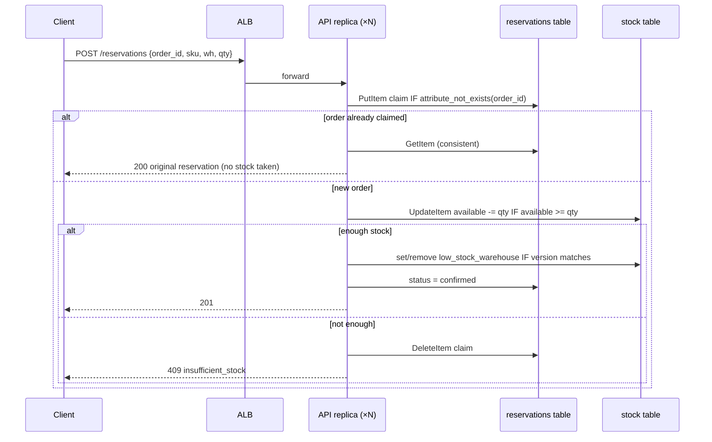
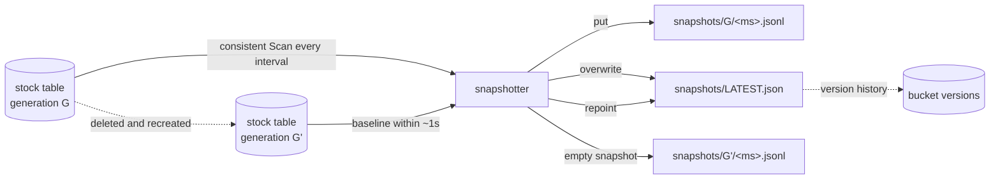
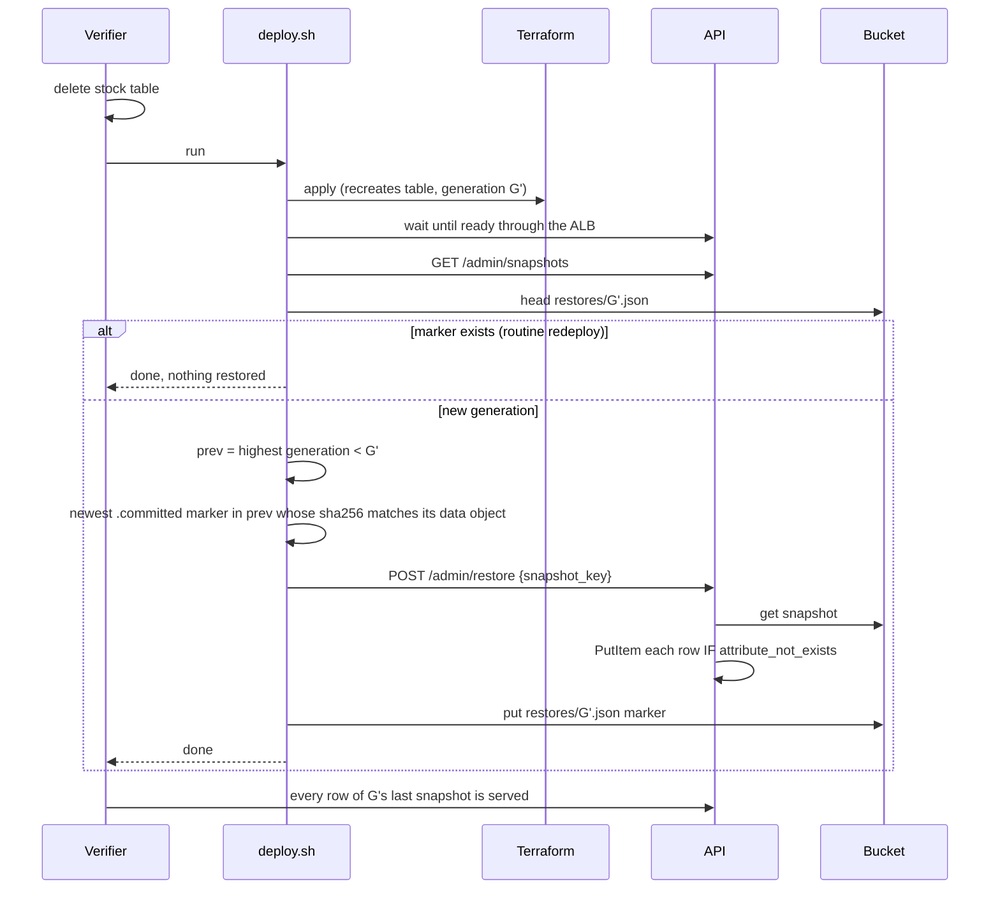
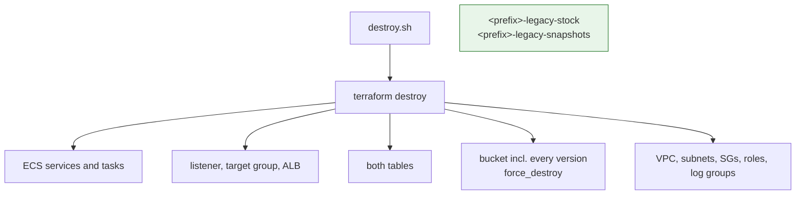

# DepotLedger Inventory Consistency

## Introduction

DepotLedger is the inventory ledger behind a multi-warehouse fulfilment
business. Storefronts reserve stock and warehouses restock it. Two properties
matter above everything else: stock is never promised twice, and losing the
ledger table is survivable.

The supplied API already implements the ledger logic on DynamoDB: conditional
writes, idempotent reservations, a sparse low-stock marker, and a restore
routine that never overwrites. What it cannot do is bring its own data
platform. The model has to build that platform with Terraform or OpenTofu:
two tables whose keys, index keys and projections must be exactly right, TTL
and point-in-time recovery, a versioned snapshot bucket with a noncurrent
retention rule, two ECS services and a load balancer. It then has to operate
the platform. A redeploy must replace nothing. A deleted stock table must come
back with its data before `deploy.sh` returns. Destroy must remove a versioned
bucket completely while leaving alone look-alike resources that belong to
someone else.

Two standard-library images make these flows real and make infrastructure
mistakes *observable* from outside:

- The **API image** answers the warehouse and low-stock views from their
  indexes alone. If an index is missing, has the wrong keys, or projects too
  little, the view fails with a named error. The API does not fall back to the
  base table, so a `KEYS_ONLY` index is visible as a product failure and not
  hidden by a scan. The admin surface lists snapshots and restores one, and it
  refuses to restore a snapshot into the table generation it came from.
- The **snapshotter image** writes a consistent JSON Lines scan of the stock
  table every interval, plus a baseline snapshot the moment it sees a new
  table generation, and overwrites `snapshots/LATEST.json` each time.

Neither image installs a package. The benchmark measures cloud skill, not
application code, and a dependency-free image cannot fail a trial because of a
package index.

### Where the difficulty is

1. **Index design is exact.** Two GSIs with specified keys and types. One is
   sparse, keyed on an attribute that exists only while a row is low. The
   other is the warehouse view. Both must project five non-key attributes. A
   model that writes `KEYS_ONLY`, forgets to declare `low_stock_warehouse`, or
   swaps hash and range fails a behavior check that the emulator really
   executes: its GSI queries apply the declared projection.
2. **The restore trap.** After the stock table is deleted, a naive
   `terraform apply` recreates it empty and the deployment looks healthy. The
   contract requires `deploy.sh` to notice the new generation and restore it
   before returning. Within about a second of recreation, the snapshotter
   writes an empty baseline of the new generation and repoints `LATEST.json`
   at it. So "restore from LATEST" restores nothing, and the admin endpoint
   refuses it anyway (`snapshot_generation_current`). The right source is the
   newest snapshot of the **previous** generation, which the contract
   describes and the listing endpoint exposes.
3. **No resurrection.** A row deleted through the API after a snapshot must
   stay deleted across a routine redeploy. The admin endpoint already refuses
   same-generation restores, so this check targets deployments that bypass it
   and write snapshot rows into the live table themselves, for example with
   `batch-write-item` on every run. The check deletes the row and reruns
   deploy immediately. If the snapshotter takes a newer snapshot before the
   rogue restore reads one, the deleted row is absent from it and the defect
   goes unseen. Detection is therefore likely but not guaranteed, and a
   correct deployment can never fail it. The same check deterministically
   catches the more common mistake: a redeploy that replaces a table, for
   example because its name embeds a timestamp or a random suffix.
4. **Destroying a versioned bucket, and only that bucket.** The snapshot bucket
   accumulates hundreds of versions. Deleting current objects is not enough.
   Meanwhile the verifier pre-creates a `<prefix>-legacy-stock` table and a
   versioned `<prefix>-legacy-snapshots` bucket. A cleanup script that deletes
   by prefix pattern destroys resources it does not own and is capped.
5. **Concurrency is real.** Thirty concurrent reservations for ten units, sent
   through the load balancer, must produce exactly ten successes. The API's
   conditional update makes this correct *if* both replicas share the right
   table and key. Overselling caps the score.

### What v6 adds, and why

Realm v5 produced five 100% runs out of six. v6 adds two operational rules,
both stated in the public contract and both triggered by the verifier
deterministically, with no timing races.

6. **Committed snapshots and two losses.** The snapshotter now writes each
   snapshot in two steps: the data object, then a `.committed` marker carrying
   the object's SHA-256. Only a marker whose `sha256` matches makes a snapshot
   restorable. The verifier loses the stock table twice. Between the losses it
   deletes one row, updates another and adds a third. Before the second loss
   it leaves the exact state a snapshotter crash produces: a newer data object
   in the live generation with no marker, holding the deleted row, the stale
   value and a foreign row. Restore must come from the newest committed
   snapshot of the generation that was just lost. The v5 rule every passing
   model used, "newest snapshot of any non-current generation", picks the
   uncommitted object.
7. **Durable-control drift repair on the same bucket.** Versioning is suspended
   and the lifecycle configuration deleted through the S3 API. The next deploy
   must repair both on the same bucket, keep every earlier object version, and
   retain new pointer versions again. Deployments that apply with
   `-refresh=false`, or "reset" by replacing the bucket, fail.

8. **Committed content survives an overwrite (v6i, after Realm v7: 3 of 6
   full passes).** "Committed" now means that the marker exists **and some
   version** of the data object matches the marker's `sha256`. That version
   is the committed content, even if the object was overwritten afterwards.
   Before the first loss, the verifier writes the newest committed snapshot
   of the generation by the public protocol: data object, then marker. Its
   committed content is the natural snapshot plus one late row. It then
   overwrites the data object with stale content: a dropped row plus a poison
   row. Only restoring the matching **version**, through the new `version_id`
   on the restore endpoint, passes:
   - "marker exists → restore current" brings back the poison row;
   - "verify current hash, else skip" falls back to the older snapshot and
     misses the late row;
   - the v5 "newest non-current" rule does both.

   This makes versioning a recovery control, not only a checkbox. It uses
   only emulator behaviors already exercised by passing oracles: versioned
   PUT/GET by `VersionId` and `ListObjectVersions`. No Terraform or provider
   change is involved; the online-index idea (D) was dropped after the
   provider could not observe a GSI added in place on Floci.

### What this environment enforces, and what it only records

The pinned emulator **executes** DynamoDB conditional writes, key schemas,
GSI queries with their declared projections, TTL expiry, S3 versioning and
version listing, ECS tasks as real containers, and ALB forwarding with health
checks. Those carry the behavior and lifecycle score.

It **records but does not enforce** IAM policies, security groups, bucket
default encryption and S3 lifecycle expiry. Those are scored only as
declarations read from state, and every such check says so. No obligation
claims that IAM denied a call or that a lifecycle rule expired a version.

## Infrastructure Used

| Service | Job in this task |
|---|---|
| **DynamoDB, stock table** | The ledger. Key `sku` + `warehouse_id`. Two GSIs (`by_warehouse`, sparse `low_stock`) with a five-attribute projection. PITR enabled. The API writes it with conditional updates, and the snapshotter scans it. |
| **DynamoDB, reservations table** | The idempotency ledger. Key `order_id`, with TTL on `expires_at`. A replayed order finds its claim here and takes no stock. It must survive loss of the stock table. |
| **S3, snapshot bucket** | Versioned store for snapshots and the `LATEST.json` pointer, with a public access block, default encryption and a noncurrent-version expiry equal to the per-run retention value. It also holds whatever restore bookkeeping the deployment keeps. |
| **ECS (Fargate)** | API service at `api_desired_count` replicas behind the ALB, and exactly one snapshotter. Private subnets, no public IP, separate task roles. |
| **ALB** | Public entry for the API; health checks `/health/ready`, which fails while a table is missing. |
| **VPC, subnets, IGW, route tables, security groups** | Two AZs. Public subnets for the ALB, private subnets for tasks. The API admits the ALB only, and the snapshotter admits nothing. |
| **IAM** | Execution role scoped to log groups. API role: table read/write, snapshot read, no object writes. Snapshotter role: describe/scan, put snapshots, no item writes. |
| **CloudWatch Logs** | One group per service with retention. Structured JSON lines, token never logged. |

## Operational Flows

### Reservation under concurrency

### Snapshots and generations

### Table loss and restore (reference deploy)

The marker is one correct design, not the required one. A deployment may
equally compare against a recorded generation, check whether the table is
empty, or write its own restore. The checks assert the outcome: rows back,
nothing resurrected, and other durable resources untouched.

### Destroy

## Score

Sixteen obligations, each all-or-nothing, in five categories. The weights
reconcile to 100 in `tests/suite/obligations.yaml`. Only 100 passes.

| Category | Points | Obligations |
|---|---:|---|
| Snapshot durability, restore and repair | 45 | `lifecycle.second_loss_committed` 13, `lifecycle.table_loss_restore` 9, `lifecycle.bucket_drift_repair` 9, `lifecycle.redeploy_preserves_data` 5, `observed.snapshots_versioned` 5, `declared.snapshot_bucket` 4 |
| Inventory consistency | 20 | `observed.no_oversell` 9 (gate), `observed.stock_roundtrip` 6, `observed.idempotent_reservation` 5 |
| Table and index design | 17 | `declared.table_design` 6, `realized.data_plane` 6, `observed.low_stock_index` 5 |
| Redeploy and destruction | 10 | `lifecycle.destroy_clean` 6 (gate), `lifecycle.reapply_stable` 4 |
| Managed platform and isolation | 8 | `declared.managed_iac` 4 (gate), `declared.network_and_iam` 4 |

By plane: 46 lifecycle, 30 observed, 6 realized, 18 declared.

Run order: declared → realized → observed → routine redeploy → drift
repair → first loss → second loss → standalone plan → destroy.

- **`lifecycle.second_loss_committed` (13).** After the first recovery, the
  live generation diverges and a committed snapshot captures it. An
  uncommitted, newer data object of the same generation, holding stale and
  foreign rows, is placed in the bucket. The table is deleted again. When
  deploy returns: every row of the newest committed snapshot is served with
  its values, the deleted row stays deleted, the updated row keeps its new
  value, no uncommitted-only row appears, and the reservations table, bucket
  and ALB keep their identity.
- **`lifecycle.bucket_drift_repair` (9).** The fault is confirmed applied. Then:
  same bucket name and creation date, versioning `Enabled`, the rule back with
  the configured days, every earlier pointer version retrievable, and new
  versions accruing.
- **`lifecycle.table_loss_restore` (9).** The first loss. The newest committed
  snapshot's data object has been overwritten. When deploy returns, every row
  of its committed content (the version matching the marker) must be served,
  including the late row that exists only there. No row of the overwriting
  version may appear.
- All other obligations are as in v5 at the weights above. The destroy check
  keeps the emulator `/ecs/<family>` log-group exclusion.

Gates: `trial.integrity`, `declared.managed_iac`, `observed.no_oversell`,
`lifecycle.baseline_preserved`. Caps: oversell → 49, cleanup leak or
collateral deletion → 79.

Known-bad coverage lives beside the task in `../depotledger-certification-v6/`:
ten variants, including `restore_ignores_commit` (the v5 rule),
`drift_apply_without_refresh` and `drift_recreate_bucket`.
