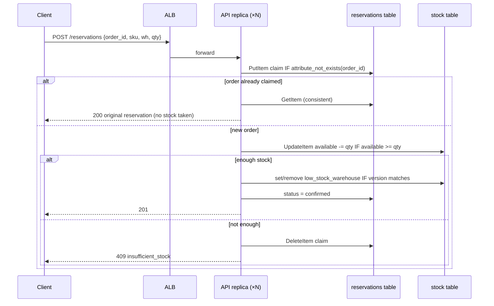
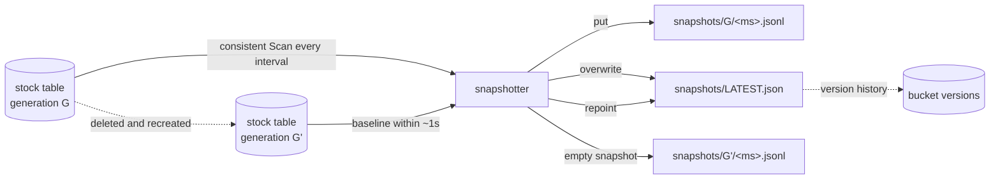
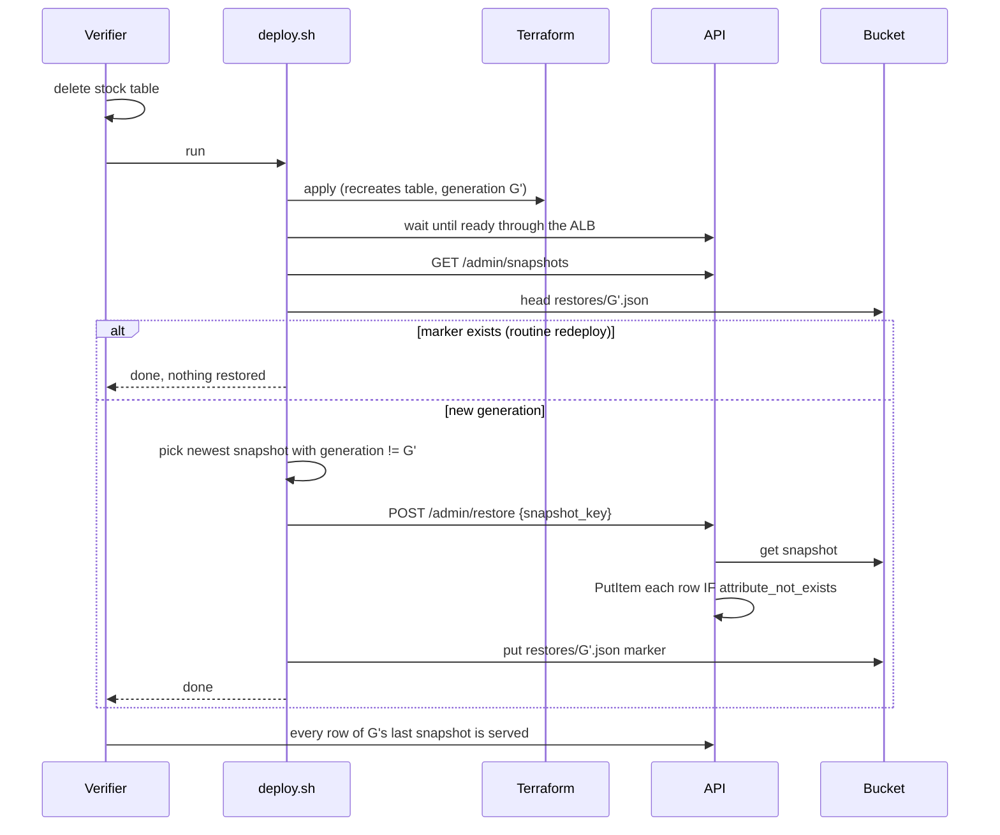
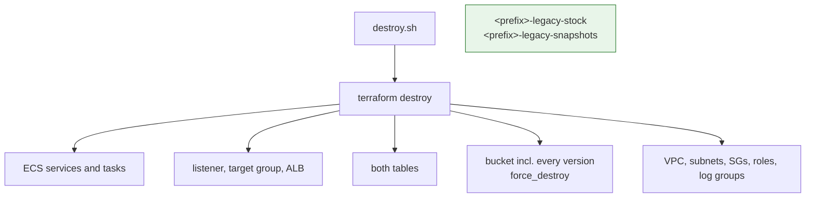

# DepotLedger Inventory Consistency

## Introduction

DepotLedger is the inventory ledger behind a multi-warehouse fulfilment
business. Storefronts reserve stock and warehouses restock it. Two properties
matter above everything else: stock is never promised twice, and losing the
ledger table is survivable.

The supplied API already implements the ledger logic on DynamoDB: conditional
writes, idempotent reservations, a sparse low-stock marker, and a restore
routine that never overwrites. What it cannot do is bring its own data
platform. The model has to build that platform with Terraform or OpenTofu:
two tables whose keys, index keys and projections must be exactly right, TTL
and point-in-time recovery, a versioned snapshot bucket with a noncurrent
retention rule, two ECS services and a load balancer. It then has to operate
the platform. A redeploy must replace nothing. A deleted stock table must come
back with its data before `deploy.sh` returns. Destroy must remove a versioned
bucket completely while leaving alone look-alike resources that belong to
someone else.

Two standard-library images make these flows real and make infrastructure
mistakes *observable* from outside:

- The **API image** answers the warehouse and low-stock views from their
  indexes alone. If an index is missing, has the wrong keys, or projects too
  little, the view fails with a named error. The API does not fall back to the
  base table, so a `KEYS_ONLY` index is visible as a product failure and not
  hidden by a scan. The admin surface lists snapshots and restores one, and it
  refuses to restore a snapshot into the table generation it came from.
- The **snapshotter image** writes a consistent JSON Lines scan of the stock
  table every interval, plus a baseline snapshot the moment it sees a new
  table generation, and overwrites `snapshots/LATEST.json` each time.

Neither image installs a package. The benchmark measures cloud skill, not
application code, and a dependency-free image cannot fail a trial because of a
package index.

### Where the difficulty is

1. **Index design is exact.** Two GSIs with specified keys and types. One is
   sparse, keyed on an attribute that exists only while a row is low. The
   other is the warehouse view. Both must project five non-key attributes. A
   model that writes `KEYS_ONLY`, forgets to declare `low_stock_warehouse`, or
   swaps hash and range fails a behavior check that the emulator really
   executes: its GSI queries apply the declared projection.
2. **The restore trap.** After the stock table is deleted, a naive
   `terraform apply` recreates it empty and the deployment looks healthy. The
   contract requires `deploy.sh` to notice the new generation and restore it
   before returning. Within about a second of recreation, the snapshotter
   writes an empty baseline of the new generation and repoints `LATEST.json`
   at it. So "restore from LATEST" restores nothing, and the admin endpoint
   refuses it anyway (`snapshot_generation_current`). The right source is the
   newest snapshot of the **previous** generation, which the contract
   describes and the listing endpoint exposes.
3. **No resurrection.** A row deleted through the API after a snapshot must
   stay deleted across a routine redeploy. The admin endpoint already refuses
   same-generation restores, so this check targets deployments that bypass it
   and write snapshot rows into the live table themselves, for example with
   `batch-write-item` on every run. The check deletes the row and reruns
   deploy immediately. If the snapshotter takes a newer snapshot before the
   rogue restore reads one, the deleted row is absent from it and the defect
   goes unseen. Detection is therefore likely but not guaranteed, and a
   correct deployment can never fail it. The same check deterministically
   catches the more common mistake: a redeploy that replaces a table, for
   example because its name embeds a timestamp or a random suffix.
4. **Destroying a versioned bucket, and only that bucket.** The snapshot bucket
   accumulates hundreds of versions. Deleting current objects is not enough.
   Meanwhile the verifier pre-creates a `<prefix>-legacy-stock` table and a
   versioned `<prefix>-legacy-snapshots` bucket. A cleanup script that deletes
   by prefix pattern destroys resources it does not own and is capped.
5. **Concurrency is real.** Thirty concurrent reservations for ten units, sent
   through the load balancer, must produce exactly ten successes. The API's
   conditional update makes this correct *if* both replicas share the right
   table and key. Overselling caps the score.

### What this environment enforces, and what it only records

The pinned emulator **executes** DynamoDB conditional writes, key schemas,
GSI queries with their declared projections, TTL expiry, S3 versioning and
version listing, ECS tasks as real containers, and ALB forwarding with health
checks. Those carry the behavior and lifecycle score.

It **records but does not enforce** IAM policies, security groups, bucket
default encryption and S3 lifecycle expiry. Those are scored only as
declarations read from state, and every such check says so. No obligation
claims that IAM denied a call or that a lifecycle rule expired a version.

## Infrastructure Used

| Service | Job in this task |
|---|---|
| **DynamoDB, stock table** | The ledger. Key `sku` + `warehouse_id`. Two GSIs (`by_warehouse`, sparse `low_stock`) with a five-attribute projection. PITR enabled. The API writes it with conditional updates, and the snapshotter scans it. |
| **DynamoDB, reservations table** | The idempotency ledger. Key `order_id`, with TTL on `expires_at`. A replayed order finds its claim here and takes no stock. It must survive loss of the stock table. |
| **S3, snapshot bucket** | Versioned store for snapshots and the `LATEST.json` pointer, with a public access block, default encryption and a noncurrent-version expiry equal to the per-run retention value. It also holds whatever restore bookkeeping the deployment keeps. |
| **ECS (Fargate)** | API service at `api_desired_count` replicas behind the ALB, and exactly one snapshotter. Private subnets, no public IP, separate task roles. |
| **ALB** | Public entry for the API; health checks `/health/ready`, which fails while a table is missing. |
| **VPC, subnets, IGW, route tables, security groups** | Two AZs. Public subnets for the ALB, private subnets for tasks. The API admits the ALB only, and the snapshotter admits nothing. |
| **IAM** | Execution role scoped to log groups. API role: table read/write, snapshot read, no object writes. Snapshotter role: describe/scan, put snapshots, no item writes. |
| **CloudWatch Logs** | One group per service with retention. Structured JSON lines, token never logged. |

## Operational Flows

### Reservation under concurrency

### Snapshots and generations

### Table loss and restore (reference deploy)

The marker is one correct design, not the required one. A deployment may
equally compare against a recorded generation, check whether the table is
empty, or write its own restore. The checks assert the outcome: rows back,
nothing resurrected, and other durable resources untouched.

### Destroy

## Score

Fourteen obligations, each all-or-nothing, grouped into five categories. The
weights reconcile to 100 in `tests/suite/obligations.yaml`, and the verifier
refuses to start if they do not. Only 100 passes.

| Category | Points | Obligations |
|---|---:|---|
| Snapshot durability and restore | 30 | `lifecycle.table_loss_restore` 14, `observed.snapshots_versioned` 6, `declared.snapshot_bucket` 5, `lifecycle.redeploy_preserves_data` 5 |
| Inventory consistency | 26 | `observed.no_oversell` 12, `observed.stock_roundtrip` 8, `observed.idempotent_reservation` 6 |
| Table and index design | 22 | `declared.table_design` 8, `realized.data_plane` 8, `observed.low_stock_index` 6 |
| Redeploy and destruction | 13 | `lifecycle.destroy_clean` 9, `lifecycle.reapply_stable` 4 |
| Managed platform and isolation | 9 | `declared.network_and_iam` 5, `declared.managed_iac` 4 |

By plane: 38 points observed through real requests, 32 lifecycle, 8 realized
from live APIs, and 22 declared from state.

What each proves, highest value first:

- **`lifecycle.table_loss_restore` (14).** Rows are seeded and captured in a
  snapshot. The stock table is deleted and `deploy.sh` is rerun. When it
  returns, every row of that snapshot is served with the same `on_hand` and
  `reserved`. The reservations table (by ARN and creation time), the bucket and
  the ALB keep their identity. An earlier order still replays without taking
  stock, and earlier snapshot versions are still present.
- **`observed.no_oversell` (12, gate).** Thirty concurrent single-unit
  reservations on a ten-unit row. Exactly ten succeed and twenty are refused
  as `insufficient_stock`. The row ends at `available 0 / reserved 10`. More
  than ten successes caps the run at 49.
- **`observed.stock_roundtrip` (8).** Fresh rows read back by SKU, and the
  warehouse view returns exactly that warehouse's rows from the index.
- **`declared.table_design` (8).** Key schema and key types for both tables,
  both GSIs with exact keys and a sufficient projection, on-demand billing,
  PITR and TTL, all from state.
- **`realized.data_plane` (8).** The same facts as the endpoint reports them
  live (`DescribeTable`, `DescribeTimeToLive`, `DescribeContinuousBackups`,
  `GetBucketVersioning`), plus healthy target count and exactly one
  snapshotter.
- **`lifecycle.destroy_clean` (9, gate).** After `destroy.sh`, nothing
  carrying the prefix remains, versioned bucket included. The pre-created
  legacy table (with its row) and legacy bucket (with its versions) are
  intact. A leak or collateral deletion caps the run at 79.
- **`observed.low_stock_index` (6).** A row enters the sparse index when a
  reservation takes it to its reorder point and leaves it after restock. Low
  rows in other warehouses never appear.
- **`observed.idempotent_reservation` (6).** An identical replay returns the
  original `reservation_id` with `200` and takes no units. A conflicting
  replay is refused. The stored claim carries `expires_at` about
  `idempotency_ttl_seconds` in the future.
- **`observed.snapshots_versioned` (6).** A fresh row appears in a snapshot of
  the current generation within four intervals, `LATEST.json` points at the
  current generation, and it has more than one retained version.
- **`declared.snapshot_bucket` (5).** Versioning, a full public access block,
  default encryption, and noncurrent expiry equal to the per-run retention
  value. Encryption and lifecycle are labelled declaration-only.
- **`lifecycle.redeploy_preserves_data` (5).** A row is deleted after it was
  snapshotted, another is written, and deploy is rerun. Identities are
  unchanged, the deleted row stays deleted, and the newer row survives.
- **`declared.network_and_iam` (5).** Tasks run in private subnets without
  public IPs. The API and snapshotter have distinct task roles. The API role
  cannot put or delete objects, the snapshotter role cannot write items, and
  no policy is a wildcard. Declaration only.
- **`declared.managed_iac` (4, gate).** Every scored resource family is in
  state and the manifest resolves to it.
- **`lifecycle.reapply_stable` (4).** `terraform plan -refresh=false` run
  directly against `infra/` resolves every variable and plans no create or
  delete.

Gates: `trial.integrity` (harness faults invalidate rather than score),
`declared.managed_iac`, `observed.no_oversell` and
`lifecycle.baseline_preserved`. Caps: oversell → 49, cleanup leak or
collateral deletion → 79.
